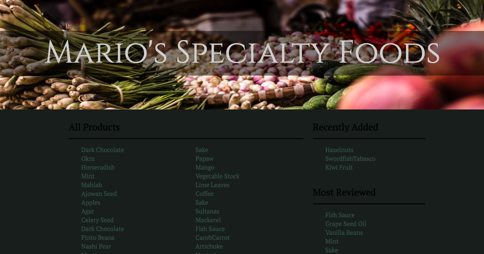

# Mario's Specialty Foods

#### Ruby on Rails Basics Independent Project 6/30/2017

#### By Monique St. Laurent

This is a website for a gourmet food store, built using Ruby on Rails. It uses an Active Record database to store product information, and reviews, which allows users to view, add, update and delete items. Validations and callbacks are used to make sure that information in the database is properly saved and formatted. Scopes are also used to display products that meet certain criteria.

## Landing Page

## Installation and Setup

1. Run:
*  `$ git clone https://github.com/moinstla/marios-specialty-foods.git`
* `$ cd marios-specialty-foods`
* `$ rails db:create`
* `$ rails db:migrate`
* `$ rails db:seed`
* `$ rails server`

2. Navigate to http://localhost:3000

## Technologies Used
Ruby
Rails
Javascript
Jquery
HTML
CSS
Bootstrap

## License Information

MIT License

Copyright (c) 2017

Permission is hereby granted, free of charge, to any person obtaining a copy of this software and associated documentation files (the "Software"), to deal in the Software without restriction, including without limitation the rights to use, copy, modify, merge, publish, distribute, sublicense, and/or sell copies of the Software, and to permit persons to whom the Software is furnished to do so, subject to the following conditions:

The above copyright notice and this permission notice shall be included in all copies or substantial portions of the Software.

THE SOFTWARE IS PROVIDED "AS IS", WITHOUT WARRANTY OF ANY KIND, EXPRESS OR IMPLIED, INCLUDING BUT NOT LIMITED TO THE WARRANTIES OF MERCHANTABILITY, FITNESS FOR A PARTICULAR PURPOSE AND NONINFRINGEMENT. IN NO EVENT SHALL THE AUTHORS OR COPYRIGHT HOLDERS BE LIABLE FOR ANY CLAIM, DAMAGES OR OTHER LIABILITY, WHETHER IN AN ACTION OF CONTRACT, TORT OR OTHERWISE, ARISING FROM, OUT OF OR IN CONNECTION WITH THE SOFTWARE OR THE USE OR OTHER DEALINGS IN THE SOFTWARE.
